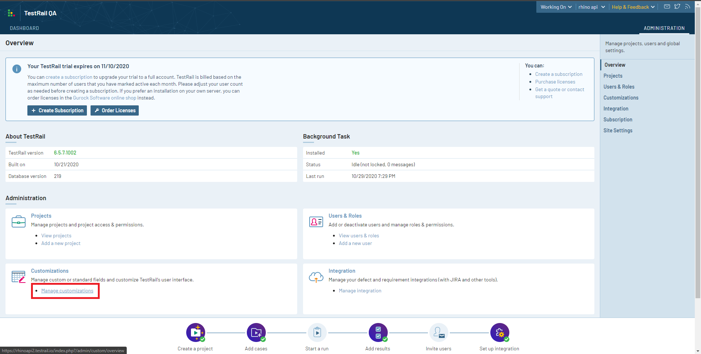
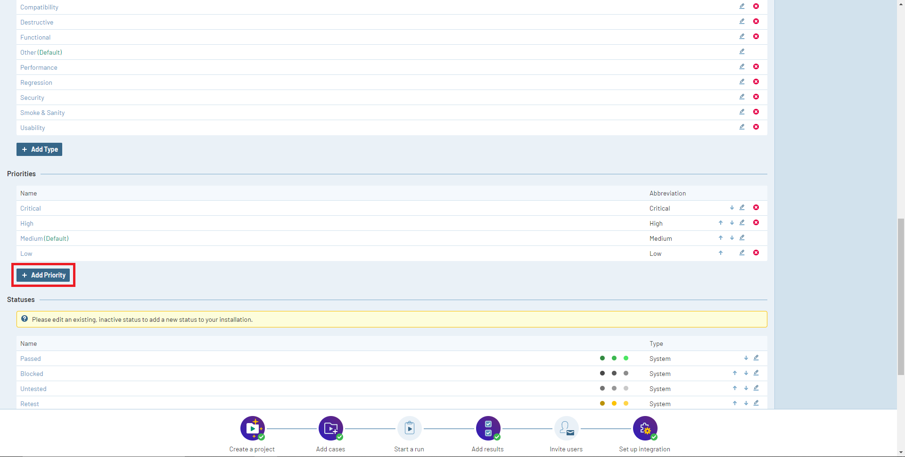
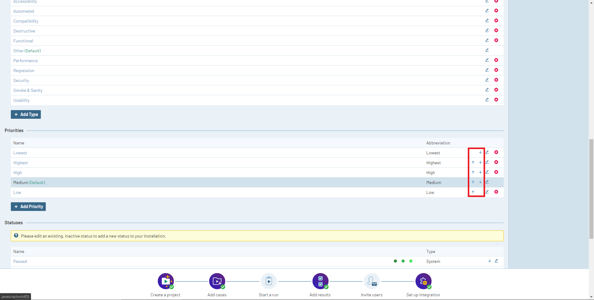
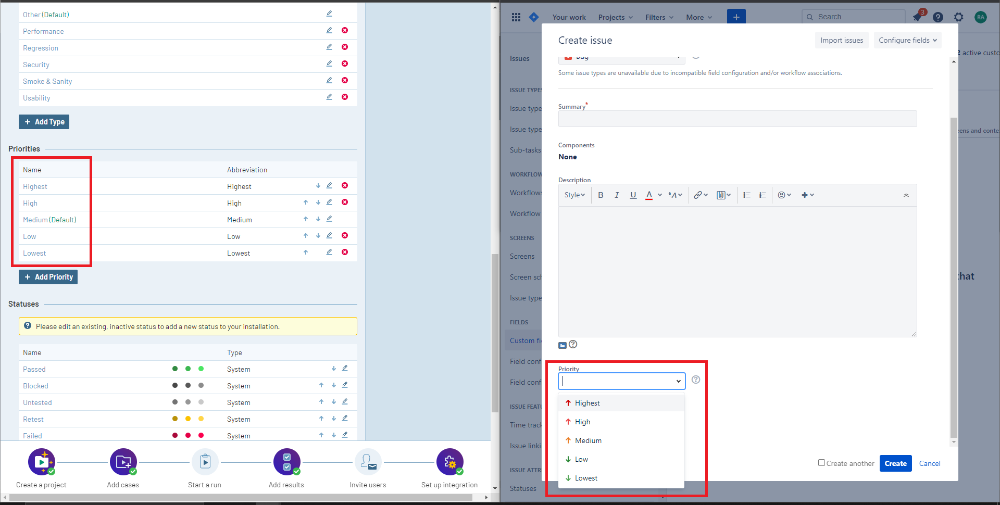
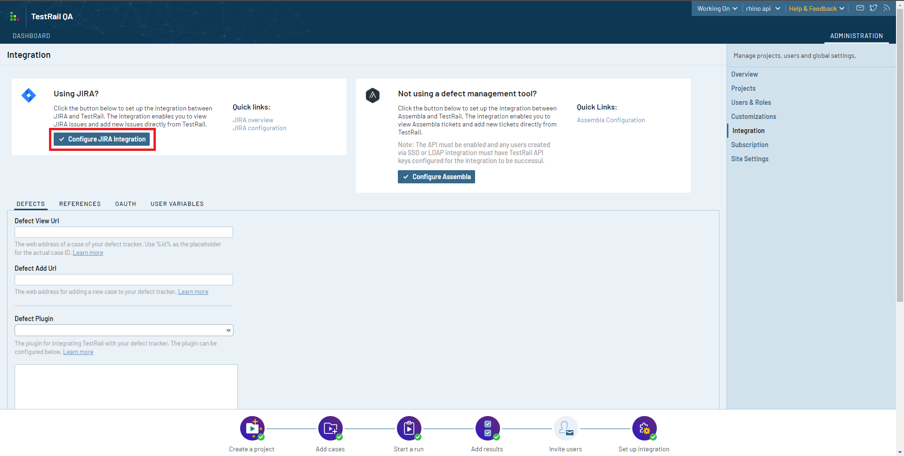

[Home](../../docs/README.md 'README') 

# TestRail Configuration
11/01/2020 - 25 minutes to read

## In This Article
* [Priorities Configuration](#priorities-configuration)
* [Jira Integration Configuration](#jira-integration-configuration)  

> Rhino can be integrated with both Jira Server (on premise) and Jira cloud.

In order so successfully integrate with Jira, TestRail requires some adjustments and setups. Without these setups, some of the features (like bugs manager) might not work properly.

## Priorities Configuration
Rhino uses the case priority as the priority value when creating a bug for that case. In order to make sure the integration is correct, the priorities list must match on both TestRail and Jira sides.  

Assuming that Jira priorities are as follow (names and order):
1. Highest
2. High
3. Medium
4. Low
5. Lowest  

Please follow these steps in order to align TestRail priorities with Jira:  

1. From TestRail main page, click on **Administration** link.  

  
_image - Administration Link_  

2. From the **Administration** page under **Customizations** tile, click on **Manage Customizations** link.  

  
_image - Customizations Link_  

3. Find **Priorities** panel under **Manage Customizations** and click on **Add Priority** button.

  
_image - Add Priority Button_  

4. Under **Add Priority** screen
    1. Type **Lowest** into **Name** text-box.
    2. Type **Lowest** into **Abbreviation** text-box.
    3. Click on **Add Priority** button.  

  
_image - Add Priority Screen_  

5. Find **Priorities** panel under **Manage Customizations** and click on **Edit Priority** button under **Critical** priority.  

  
_image - Edit Priority Button_  

6. Under **Edit Priority** screen
    1. Type **Highest** into **Highest** text-box instead of **Critical**.
    2. Type **Highest** into **Abbreviation** text-box instead of **Critical**.
    3. Click on **Save Priority** button.  

  
_image - Add Priority Screen_  

7. Using the arrows arrange the priorities in the same order as they appear in Jira
    1. Highest
    2. High
    3. Medium
    4. Low
    5. Lowest  

  
_image - Priority Arrows_  

8. Under Jira, open **Create Issue** screen find **Priority** field, delete the value in it, and click to expand it. It is expected that the values in Jira will be the same with both name and order as in TestRail.  

  
_image - Final Result_

## Jira Integration Configuration
Jira integration allows Test R

1. From TestRail main page, click on **Administration** link.  

  
_image - Administration Link_  

2. From the **Administration** page under **Integration** tile, click on **Manage Integration** link.  

  
_image - Integration Link_  

3. Click on **Configure Jira Integration button**.  

  
_image - Configure Jira Integration_  

4. Under **Configure Jira Integration** screen do the following:
    1. Provide your Jira Cloud Web Address URL. Usually, it looks something like "https://yourcustomname.atlassian.net".
    2. Under **Jira Version**, it set Jira Cloud as the option.
    3. Under **Jira Email address**, provide the email address you have with your Jira Cloud instance.
    4. Under **Jira API Token**, provide your [Jira Cloud API Token](https://docs.gitlab.com/ee/user/project/integrations/jira_cloud_configuration.html).
    5. Ensure that both the **Defect** and **Reference** checkboxes are enabled and click on **Save Settings** button.  

  
_image - Configure Jira Integration_  

5. Scroll down and click on **Save Settings** button to finalize the changes.

## See Also
* [Configuring the Jira Cloud Integration](https://www.gurock.com/testrail/docs/integrate/tools/jira/cloud)
* [TestRail Case](https://www.tutorialspoint.com/testrail/testrail_case.htm)
* [How to Create Jira API Token](https://docs.gitlab.com/ee/user/project/integrations/jira_cloud_configuration.html)